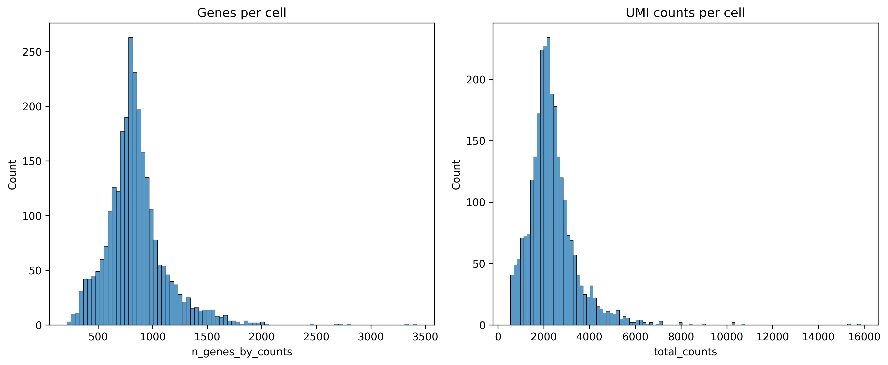

# Single Cell Analysis Report

Generated: 2025-04-10 11:22:32

## run_basic_qc,           

Tool `run_basic_qc,           ` was run. Output: Basic QC metrics computed. Dataset has 2700 cells and 32738 genes. QC plot saved.. What does this result mean?

